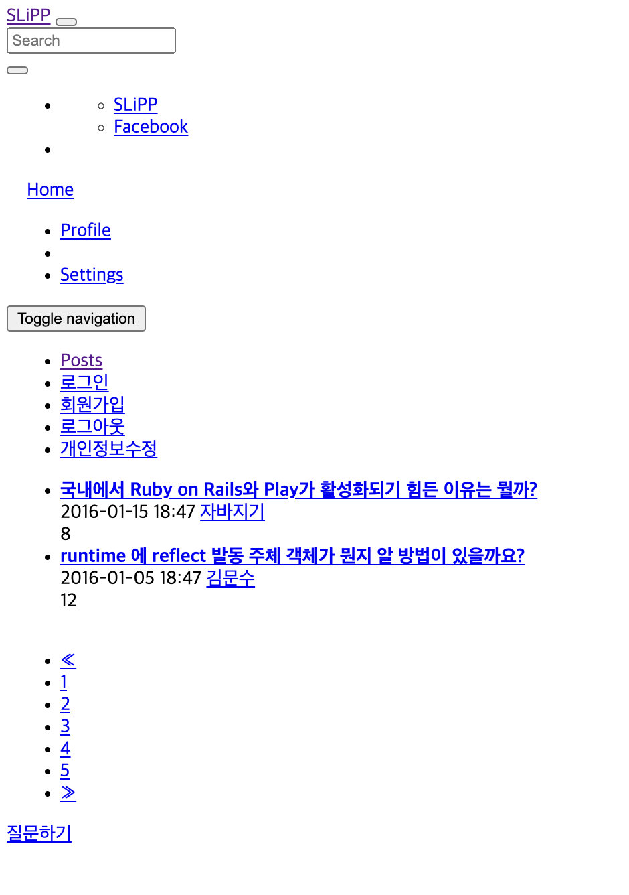

# 실습을 위한 개발 환경 세팅
* https://github.com/slipp/web-application-server 프로젝트를 자신의 계정으로 Fork한다. Github 우측 상단의 Fork 버튼을 클릭하면 자신의 계정으로 Fork된다.
* Fork한 프로젝트를 eclipse 또는 터미널에서 clone 한다.
* Fork한 프로젝트를 eclipse로 import한 후에 Maven 빌드 도구를 활용해 eclipse 프로젝트로 변환한다.(mvn eclipse:clean eclipse:eclipse)
* 빌드가 성공하면 반드시 refresh(fn + f5)를 실행해야 한다.

# 웹 서버 시작 및 테스트
* webserver.WebServer 는 사용자의 요청을 받아 RequestHandler에 작업을 위임하는 클래스이다.
* 사용자 요청에 대한 모든 처리는 RequestHandler 클래스의 run() 메서드가 담당한다.
* WebServer를 실행한 후 브라우저에서 http://localhost:8080으로 접속해 "Hello World" 메시지가 출력되는지 확인한다.

# 각 요구사항별 학습 내용 정리
* 구현 단계에서는 각 요구사항을 구현하는데 집중한다. 
* 구현을 완료한 후 구현 과정에서 새롭게 알게된 내용, 궁금한 내용을 기록한다.
* 각 요구사항을 구현하는 것이 중요한 것이 아니라 구현 과정을 통해 학습한 내용을 인식하는 것이 배움에 중요하다. 

### 요구사항 1 - http://localhost:8080/index.html로 접속시 응답

---
1. 요청을 하나씩 읽어야 한다. 요청은 다음과 같이 들어온다고 한다.
   
     ``` http request
    GET /index.html HTTP/1.1
    Host: localhost:8080
    Connection: keep-alive
    Accept: */*
    ```
2. 이 요청은 webserver.RequestHandler 클래스의 run() 메소드에서 받는다.  
코드는 아래와 같다.
   ```java
   public void run() {
   log.debug("New Client Connect! Connected IP : {}, Port : {}", connection.getInetAddress(),
   connection.getPort());
   
   try (InputStream in = connection.getInputStream(); OutputStream out = connection.getOutputStream()) {
      // TODO 사용자 요청에 대한 처리는 이 곳에 구현하면 된다.
      DataOutputStream dos = new DataOutputStream(out);
      byte[] body = "Hello World".getBytes();
      response200Header(dos, body.length);
      responseBody(dos, body);
   } catch (IOException e) {
        log.error(e.getMessage());
   }
   }
   ```
   
3. 이제 이 요청을 `BufferedReader` 로 읽어서 가져오면 된다. 그전에 `InputStreamReader` 로 `InputStream` 을 읽어야 한다.  
   * 간단하게 정리하면 `InputStream`은 아스키 코드로 데이터를 읽어온다. 이것을 문자로 변환해주는 것이  `InputStreamReader` 이다.  
   * 그런데 `InputStreamReader` 를 사용하려면 먼저 크기를 정해줘야 읽을 수 있다. 우리가 받을 데이터가 크기가 얼마일지 우리는 알기 쉽지 않다. 크기가 무한정일수도 있다.   
   * 이를 위해 `BufferedReader` 를 사용한다. `BufferedReader` 는 엔터를 치기 전까지 데이터를 읽어온다.  
   * [[Java] 콘솔 입력 - InputStream, BufferedReader, Scanner](https://makemethink.tistory.com/170)
   
4. 처음에 작성한 코드는 다음과 같다.
   ```java
   public void readHeader(InputStream is) throws IOException {
        InputStreamReader in = new InputStreamReader(is);
        BufferedReader br = new BufferedReader(in);
        String line = br.readLine();
        // url 자르는 용도
        String[] tokens = line.split(" ");
        while(!"".equals(line)){
            if (line == null) {
                return;
            }
           log.info("{}",line);
           line = br.readLine();
        }
    }
   ```
5. 아래의 toPath() 메소드는 Path 타입의 데이터를 리턴한다.

   그리고 File 객체는 하드디스크에 존재하는 실제 파일의 데이터가 들어가 있는게 아니고, 
   그것을 참조하는 경로를 추상화한 객체이다.

   ```java
   new File("./webapp" + url).toPath();
   ```
   이제 파일의 경로를 받아왔으니 Files.readAllBytes을 사용해 파일을 읽어오자.
   그리고 읽어온 파일을 response의 header와 body에 넣어주자.
   ```java
   byte[] body = Files.readAllBytes(new File("./webapp" + url).toPath());
   response200Header(dos, body.length);
   responseBody(dos, body);
   ```
   그러면 이제 아래와 같이 잘 나온다.
  
6. 위에서 /index.html 을 요청을 하면 css, js 등 여러 파일도 요청이 날라오게 된다.  
   이것은 index.html 안에 해당 파일을 읽어오는 href 와 같은 태그에 존재하기에  
   index.html이 로드될 때 해당 요청들이 생기는 것이다.
   
7. 해당 RequestHandler 클래스는 Thead를 확장(상속)한 것이다.  
   그렇기에 Thread 함수에 대해 알 필요가 있다.s
   <details>
     <summary>Thread란?</summary>
     <div markdown="1">
      
     * 하나의 프로세스 내부에서 독립적으로 실행되는 하나의 작업단위
     * JVM에 의해 하나의 프로세스가 발생하고 main() 안의 실행들이 하나의 쓰레이다.
     * main() 이외의 또 다른 쓰레드를 만들려면 Thread 함수를 상속하거나 Runnable 인터페이스를 구현해야한다.
     * start() 메소드를 호출하면 run() 메소드에 설정된 스레드가  Runnable 상태로 진입한다.
   
     </div>
   </details>
8. RequestHandler 클래스에서 응답은  
   DataOutputStream dos = new DataOutputStream(out); 을 통해서 나간다.  
   그러므로 DataOutputStream 에 대해 알아보자.  
   
         

### 요구사항 2 - get 방식으로 회원가입
* 

### 요구사항 3 - post 방식으로 회원가입
* 

### 요구사항 4 - redirect 방식으로 이동
* 

### 요구사항 5 - cookie
* 

### 요구사항 6 - stylesheet 적용
* 

### heroku 서버에 배포 후
* 