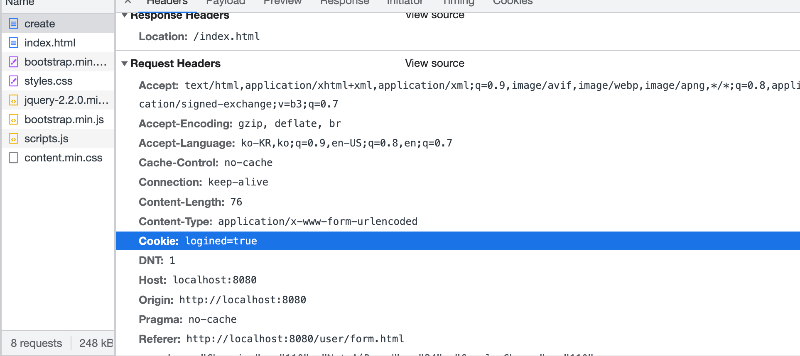

# 실습을 위한 개발 환경 세팅
* https://github.com/slipp/web-application-server 프로젝트를 자신의 계정으로 Fork한다. Github 우측 상단의 Fork 버튼을 클릭하면 자신의 계정으로 Fork된다.
* Fork한 프로젝트를 eclipse 또는 터미널에서 clone 한다.
* Fork한 프로젝트를 eclipse로 import한 후에 Maven 빌드 도구를 활용해 eclipse 프로젝트로 변환한다.(mvn eclipse:clean eclipse:eclipse)
* 빌드가 성공하면 반드시 refresh(fn + f5)를 실행해야 한다.

# 웹 서버 시작 및 테스트
* webserver.WebServer 는 사용자의 요청을 받아 RequestHandler에 작업을 위임하는 클래스이다.
* 사용자 요청에 대한 모든 처리는 RequestHandler 클래스의 run() 메서드가 담당한다.
* WebServer를 실행한 후 브라우저에서 http://localhost:8080으로 접속해 "Hello World" 메시지가 출력되는지 확인한다.
```shell
java -cp target/classes:target/dependency/* webserver.WebServer 8080 &
```

# 각 요구사항별 학습 내용 정리
* 구현 단계에서는 각 요구사항을 구현하는데 집중한다. 
* 구현을 완료한 후 구현 과정에서 새롭게 알게된 내용, 궁금한 내용을 기록한다.
* 각 요구사항을 구현하는 것이 중요한 것이 아니라 구현 과정을 통해 학습한 내용을 인식하는 것이 배움에 중요하다. 

### 요구사항 1 - http://localhost:8080/index.html로 접속시 응답
* 1단계
  - InputStream 읽기
```java
System.out.println("TEST");
BufferedReader br = new BufferedReader(new InputStreamReader(in));

String line = br.readLine();

while (!"".equals(line)) {
    line = br.readLine();
    System.out.println(line);
    if (line==null) {return;}
}
```
```text
// 결과 값

TEST    // 왜 이게 2개 찍혔을까??
TEST
Host: localhost:8080
Connection: keep-alive
Cache-Control: max-age=0
sec-ch-ua: "Not_A Brand";v="99", "Google Chrome";v="109", "Chromium";v="109"
sec-ch-ua-mobile: ?0
sec-ch-ua-platform: "macOS"
DNT: 1
Upgrade-Insecure-Requests: 1
User-Agent: Mozilla/5.0 (Macintosh; Intel Mac OS X 10_15_7) AppleWebKit/537.36 (KHTML, like Gecko) Chrome/109.0.0.0 Safari/537.36
Accept: text/html,application/xhtml+xml,application/xml;q=0.9,image/avif,image/webp,image/apng,*/*;q=0.8,application/signed-exchange;v=b3;q=0.9
Sec-Fetch-Site: cross-site
Sec-Fetch-Mode: navigate
Sec-Fetch-User: ?1
Sec-Fetch-Dest: document
Accept-Encoding: gzip, deflate, br
Accept-Language: ko-KR,ko;q=0.9,en-US;q=0.8,en;q=0.7

Host: localhost:8080
Connection: keep-alive
sec-ch-ua: "Not_A Brand";v="99", "Google Chrome";v="109", "Chromium";v="109"
DNT: 1
sec-ch-ua-mobile: ?0
User-Agent: Mozilla/5.0 (Macintosh; Intel Mac OS X 10_15_7) AppleWebKit/537.36 (KHTML, like Gecko) Chrome/109.0.0.0 Safari/537.36
sec-ch-ua-platform: "macOS"
Accept: image/avif,image/webp,image/apng,image/svg+xml,image/*,*/*;q=0.8
Sec-Fetch-Site: same-origin
Sec-Fetch-Mode: no-cors
Sec-Fetch-Dest: image
Referer: http://localhost:8080/
Accept-Encoding: gzip, deflate, br
Accept-Language: ko-KR,ko;q=0.9,en-US;q=0.8,en;q=0.7
```

* 2단계 : `/index.html` 파싱
  * 힌트를 참고하여 Util `InputStreamParser`에 함수 구현
```java
public static String RequestParse(String in) {  // 첫째줄 넣기
    String[] lineToWord = in.split(" ");
    return Arrays.stream(lineToWord)
            .filter(s -> s.matches("/.+.html"))      // 정규식으로 파싱
            .findFirst()
            .get();
}
```

* 3단계 : 요청 URL에 해당하는 파일을 webapp 디렉토리에 읽어 전달
```java
String url = InputStreamParser.RequestParse(line);
DataOutputStream dos = new DataOutputStream(out);
byte[] body = Files.readAllBytes(new File("./webapp" + url).toPath());
```
- 웹페이지를 새로고침해보니 결과는 이렇게 나왔다.
  - 딱봐도.. 로드가 제대로 이루어지지 않았다. ㅜㅜ

- 그리고 이런 에러 메시지가 콘솔에 출력되었다.
```text
Exception in thread "Thread-1" java.util.NoSuchElementException: No value present
	at java.base/java.util.Optional.get(Optional.java:143)
	at util.InputStreamParser.RequestParse(InputStreamParser.java:11)
	at webserver.RequestHandler.run(RequestHandler.java:39)

...

Exception in thread "Thread-7" java.util.NoSuchElementException: No value present
	at java.base/java.util.Optional.get(Optional.java:143)
	at util.InputStreamParser.RequestParse(InputStreamParser.java:11)
	at webserver.RequestHandler.run(RequestHandler.java:39)
```
- 관련해서 검색을 해보니 이런 에러가 나는 것은 너무나 당연했다. [참고링크](https://bryceyangs.github.io/various/2021/09/16/Book-%EC%9E%90%EB%B0%94-%EC%9B%B9-%ED%94%84%EB%A1%9C%EA%B7%B8%EB%9E%98%EB%B0%8D-Next-Step/)
  - 이를 참고해서 코드를 다시 수정했다...

```java
// 1. 파싱해오는 정규식 수정
public static String RequestParse(String in) {
    String[] lineToWord = in.split(" ");
    return Arrays.stream(lineToWord)
    .filter(s -> s.matches("/.+[/]?.[a-z]+"))
    .findFirst()
    .get();
}
```
```java
System.out.println("TEST");
BufferedReader br = new BufferedReader(new InputStreamReader(in));

String line = br.readLine();

// 전체출력
while (!"".equals(line)) {
    System.out.println(line);
    if (line==null) {return;}

    // index.html 파싱
    String url = InputStreamParser.RequestParse(line);

    System.out.println("parse result : " + url);    // 파싱이

    DataOutputStream dos = new DataOutputStream(out);
    byte[] body = Files.readAllBytes(new File("./webapp" + url).toPath());
//            byte[] body = "Hello World".getBytes();
    response200Header(dos, body.length);
    responseBody(dos, body);
    line = br.readLine();
}

// 여기까지 요구사항1
```

* 결과는 비슷했다. 요청 파일명은 파싱은 제대로 하는데, 아마 요청하는 속도와 파싱하는 속도가 달라서 그런 것일까?
  * 이리저리 고심하다 포기하고 뒷쪽 요구사항을 보니 뒤쪽에 css, js 관련 요구사항이 있다는 것을 뒤늦게 발견했다. (...)

### 요구사항 2 - get 방식으로 회원가입

```java
String url = InputStreamParser.RequestParse(line);  // index.html 파싱

Map<String, String> map = HttpRequestUtils.parseQueryString(url);

User user = new User(map.get("userId"),
        map.get("password"),
        map.get("name"),
        map.get("email"));

map.values().stream().forEach(e -> log.debug(e));   // 요소 log로 찍어봤다.
```

- 근데 결과가 좀 이상하게 나와서 파악해보니 url을 &와 =로만 구분하니 앞에있는 url까지 나와서 아예 파싱할 때 `?`로 구분 후, 파싱해야겠다고 생각했다.

```java
Map<String, String> map = HttpRequestUtils.parseQueryString(url.split("\\?")[1]);

                User user = new User(map.get("userId"),
                        map.get("password"),
                        map.get("name"),
                        map.get("email"));

                log.debug(user.getUserId() + user.getName() + user.getPassword() + user.getEmail());
```

```java
16:28:02.650 [ERROR] [Thread-1] [webserver.RequestHandler] - ./webapp/user/create?userId=user&password=1234&name=%EC%9D%B4%EC%83%88%ED%9E%98&email=saeilee.vxv%40gmail.com
```

### 요구사항 3 - post 방식으로 회원가입
* `user/form.html` 파일에서 다음을 수정했다.
```html
<form name="question" method="post" action="/user/create">  // method get -> post
              <div class="form-group">
                  <label for="userId">사용자 아이디</label>
                  <input class="form-control" id="userId" name="userId" placeholder="User ID">
              </div>
```

- 다음과 같이 코드 작성함
```java
Map<String, String> httpHeader = new HashMap<>();

while (!line.equals("")) {
    line = br.readLine();
    String[] split = line.split(":");
    try {
        httpHeader.put(split[0].trim(), split[1].trim());
    } catch (ArrayIndexOutOfBoundsException e) {
        System.out.println(e.getMessage());
    }
}

String data = IOUtils.readData(br, Integer.parseInt(httpHeader.get("Content-Length")));
Map<String, String> map = HttpRequestUtils.parseQueryString(data);

User user = new User(map.get("userId"), map.get("password"), map.get("name"), map.get("email"));
```

### 요구사항 4 - redirect 방식으로 이동
* `response302Header()` 메소드를 만들었다.
* url 이 `/user/create` 이면 호출되도록 했다.

```java
byte[] body = new byte[0];

if (url.equals("/user/create")) {
    String data = IOUtils.readData(br, Integer.parseInt(httpHeader.get("Content-Length")));
    Map<String, String> map = HttpRequestUtils.parseQueryString(data);
    User user = new User(map.get("userId"), map.get("password"), map.get("name"), map.get("email"));

    body = Files.readAllBytes(new File("./webapp/index.html").toPath());
    response302Header(dos);
} else {
    body = Files.readAllBytes(new File("./webapp" + url).toPath());
    response200Header(dos, body.length);
}
```

```java
private void response302Header(DataOutputStream dos) {
    try {
        String location = "/index.html";
        dos.writeBytes("HTTP/1.1 302 Found \r\n");
        dos.writeBytes("Location: "+ location + "\r\n");
        dos.writeBytes("\r\n");
    } catch (IOException e) {
        log.error(e.getMessage());
    }
}
```

### 요구사항 5 - cookie
* 로그인 하기
```java
case "/user/login" -> {     // 로그인
    String data = IOUtils.readData(br, Integer.parseInt(httpHeader.get("Content-Length")));
    Map<String, String> map = HttpRequestUtils.parseQueryString(data);
    User user = DataBase.findUserById(map.get("userId"));

    // 아이디가 없거나 && 비밀번호가 다른 경우
    if (user != null && Objects.equals(user.getPassword(), map.get("password"))) {
        // 로그인 성공
        System.out.println("success");
        body = Files.readAllBytes(new File("./webapp/index.html").toPath());
        response200Header(dos, body.length);
        dos.writeBytes("Set-Cookie: logined=true\r\n");
    } else {
        // 로그인 실패
        System.out.println("failed");
        body = Files.readAllBytes(new File("./webapp/user/login_failed.html").toPath());
        response302Header(dos);
    }
}
```
- 200 으로하니 오류가 생겨서 (다음 url이 `user/user/list`가 됨)
- 302로 고쳐서 다시 했다.



### 요구사항 6 - 사용자 목록 출력
* 제일 어려웠던 내용...
* html문서를 먼저 확인 한 후, 데이터를 넣을 곳에 삽입할 수 있도록 StringBuilder를 만들어 주었다.
* 보낼 body에 내요을 가져다 껴넣고 다시 body를 읽혀주어야 했다.

```java
case "/user/list" -> {      // 로그인한 상태
  try {
      Map<String, String> cookie = HttpRequestUtils.parseCookies(httpHeader.get("Cookie"));
      if (Boolean.parseBoolean(cookie.get("logined"))) {
          // 로그인 한 상태
          int idx = 3;

          Collection<User> userList = DataBase.findAll();

          StringBuilder sb = new StringBuilder();
          for(User user : userList) {
              sb.append("<tr>");
              sb.append("<th scope=\"row\">"+idx+"</th><td>"+user.getUserId()+"</td> <td>"+user.getName()+"</td> <td>"+user.getEmail()+"</td><td><a href=\"#\" class=\"btn btn-success\" role=\"button\">수정</a></td></tr>");
              idx++;
          }

          String fileData = new String(Files.readAllBytes(new File("./webapp" + url + ".html").toPath()) );
          fileData = fileData.replace("%user_list%", URLDecoder.decode(sb.toString(), "UTF-8"));

          body = fileData.getBytes();
          dos = new DataOutputStream(out);

          if (httpHeader.get("Accept").contains("text/css")) {
              response200HeaderWithCss(dos, body.length);
          } else {
              response200Header(dos, body.length);
          }
      } else {
          dos = new DataOutputStream(out);
          response302Header(dos, "/index.html");
      }
  } catch (NullPointerException e) {
      // 로그인 안된 상태
      body = Files.readAllBytes(new File("./webapp/index.html").toPath());
      dos = new DataOutputStream(out);
      response302Header(dos, "/index.html");
  }
```

### 요구사항 7. CSS 지원하기
```java
if (httpHeader.get("Accept").contains("text/css")) {
    response200HeaderWithCss(dos, body.length);
} else {
    response200Header(dos, body.length);
}
```
```java
private void response200HeaderWithCss(DataOutputStream dos, int lengthOfBodyContent) {
    try {
        dos.writeBytes("HTTP/1.1 200 OK \r\n");
        dos.writeBytes("Content-Type: text/css;charset=utf-8\r\n"); // 이부분이 포인트였다..!
        dos.writeBytes("Content-Length: " + lengthOfBodyContent + "\r\n");
        dos.writeBytes("\r\n");
    } catch (IOException e) {
        log.error(e.getMessage());
    }
}
```
- 사실 `text/css`가 없을 때가 있나? 그냥 else 부분 지워도 될 것 같다.

### heroku 서버에 배포 후
* 