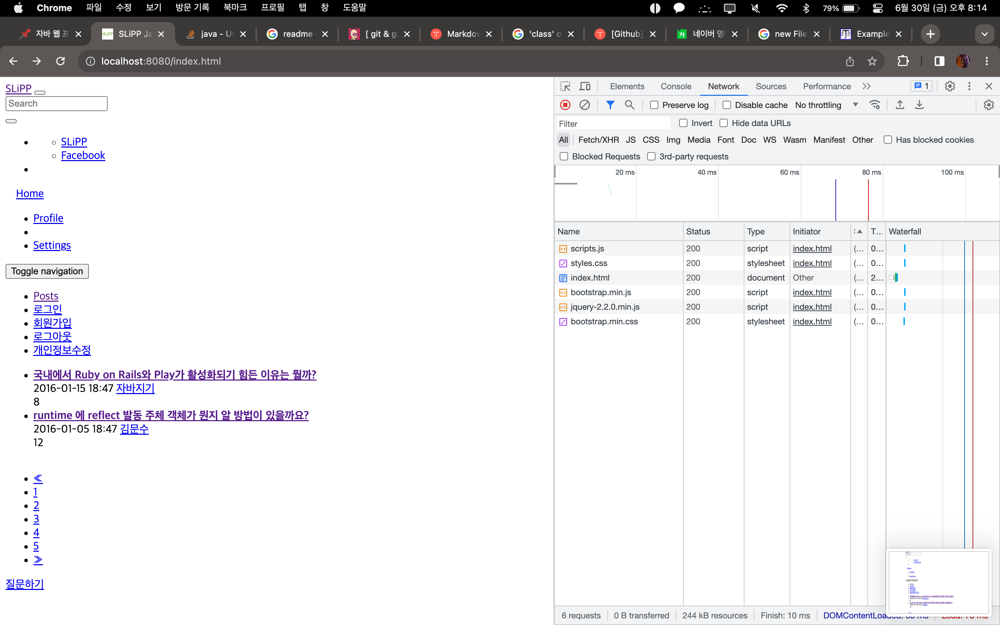

# 실습을 위한 개발 환경 세팅
* https://github.com/slipp/web-application-server 프로젝트를 자신의 계정으로 Fork한다. Github 우측 상단의 Fork 버튼을 클릭하면 자신의 계정으로 Fork된다.
* Fork한 프로젝트를 eclipse 또는 터미널에서 clone 한다.
* Fork한 프로젝트를 eclipse로 import한 후에 Maven 빌드 도구를 활용해 eclipse 프로젝트로 변환한다.(mvn eclipse:clean eclipse:eclipse)
* 빌드가 성공하면 반드시 refresh(fn + f5)를 실행해야 한다.

# 웹 서버 시작 및 테스트
* webserver.WebServer 는 사용자의 요청을 받아 RequestHandler에 작업을 위임하는 클래스이다.
* 사용자 요청에 대한 모든 처리는 RequestHandler 클래스의 run() 메서드가 담당한다.
* WebServer를 실행한 후 브라우저에서 http://localhost:8080으로 접속해 "Hello World" 메시지가 출력되는지 확인한다.

# 각 요구사항별 학습 내용 정리
* 구현 단계에서는 각 요구사항을 구현하는데 집중한다. 
* 구현을 완료한 후 구현 과정에서 새롭게 알게된 내용, 궁금한 내용을 기록한다.
* 각 요구사항을 구현하는 것이 중요한 것이 아니라 구현 과정을 통해 학습한 내용을 인식하는 것이 배움에 중요하다. 

### 요구사항 1 - http://localhost:8080/index.html로 접속시 응답

---
1. 요청을 하나씩 읽어야 한다. 요청은 다음과 같이 들어온다고 한다.
   
     ``` http request
    GET /index.html HTTP/1.1
    Host: localhost:8080
    Connection: keep-alive
    Accept: */*
    ```
2. 이 요청은 webserver.RequestHandler 클래스의 run() 메소드에서 받는다.  
코드는 아래와 같다.
   ```java
   public void run() {
   log.debug("New Client Connect! Connected IP : {}, Port : {}", connection.getInetAddress(),
   connection.getPort());
   
   try (InputStream in = connection.getInputStream(); OutputStream out = connection.getOutputStream()) {
      // TODO 사용자 요청에 대한 처리는 이 곳에 구현하면 된다.
      DataOutputStream dos = new DataOutputStream(out);
      byte[] body = "Hello World".getBytes();
      response200Header(dos, body.length);
      responseBody(dos, body);
   } catch (IOException e) {
        log.error(e.getMessage());
   }
   }
   ```
   
3. 이제 이 요청을 `BufferedReader` 로 읽어서 가져오면 된다. 그전에 `InputStreamReader` 로 `InputStream` 을 읽어야 한다.  
   * 간단하게 정리하면 `InputStream`은 아스키 코드로 데이터를 읽어온다. 이것을 문자로 변환해주는 것이  `InputStreamReader` 이다.  
   * 그런데 `InputStreamReader` 를 사용하려면 먼저 크기를 정해줘야 읽을 수 있다. 우리가 받을 데이터가 크기가 얼마일지 우리는 알기 쉽지 않다. 크기가 무한정일수도 있다.   
   * 이를 위해 `BufferedReader` 를 사용한다. `BufferedReader` 는 엔터를 치기 전까지 데이터를 읽어온다.  
   * [[Java] 콘솔 입력 - InputStream, BufferedReader, Scanner](https://makemethink.tistory.com/170)
   
4. 처음에 작성한 코드는 다음과 같다.
   ```java
   public void readHeader(InputStream is) throws IOException {
        InputStreamReader in = new InputStreamReader(is);
        BufferedReader br = new BufferedReader(in);
        String line = br.readLine();
        // url 자르는 용도
        String[] tokens = line.split(" ");
        while(!"".equals(line)){
            if (line == null) {
                return;
            }
           log.info("{}",line);
           line = br.readLine();
        }
    }
   ```
5. 아래의 toPath() 메소드는 Path 타입의 데이터를 리턴한다.

   그리고 File 객체는 하드디스크에 존재하는 실제 파일의 데이터가 들어가 있는게 아니고, 
   그것을 참조하는 경로를 추상화한 객체이다.

   ```java
   new File("./webapp" + url).toPath();
   ```
   이제 파일의 경로를 받아왔으니 Files.readAllBytes을 사용해 파일을 읽어오자.
   그리고 읽어온 파일을 response의 header와 body에 넣어주자.
   ```java
   byte[] body = Files.readAllBytes(new File("./webapp" + url).toPath());
   response200Header(dos, body.length);
   responseBody(dos, body);
   ```
   그러면 이제 아래와 같이 잘 나온다.
  
6. 위에서 /index.html 을 요청을 하면 css, js 등 여러 파일도 요청이 날라오게 된다.  
   이것은 index.html 안에 해당 파일을 읽어오는 href 와 같은 태그에 존재하기에  
   index.html이 로드될 때 해당 요청들이 생기는 것이다.
   
7. 해당 RequestHandler 클래스는 Thead를 확장(상속)한 것이다.  
   그렇기에 Thread 함수에 대해 알 필요가 있다.s
   <details>
     <summary>Thread란?</summary>
     <div markdown="1">
      
     * 하나의 프로세스 내부에서 독립적으로 실행되는 하나의 작업단위
     * JVM에 의해 하나의 프로세스가 발생하고 main() 안의 실행들이 하나의 쓰레이다.
     * main() 이외의 또 다른 쓰레드를 만들려면 Thread 함수를 상속하거나 Runnable 인터페이스를 구현해야한다.
     * start() 메소드를 호출하면 run() 메소드에 설정된 스레드가  Runnable 상태로 진입한다.
   
     </div>
   </details>
8. RequestHandler 클래스에서 응답은  
   DataOutputStream dos = new DataOutputStream(out); 을 통해서 나간다.  
   그러므로 DataOutputStream 에 대해 알아보자.
* DataOutputStream 은 출력 스트림으로, 파일이나 콘솔에 데이터를 저장하거나 출력하는 역할을 한다.  
   여기 코드에서는 응답인 OutputStream out 에 데이터를 저장하는 일을 한다.  
   ```java
   DataOutputStream dos = new DataOutputStream(out);
   ```
* 저장을 한 뒤 flush() 를 사용하는데 이것은 남아있는 데이터를 보내는 것 같다.  
   다음 실행때 남아있는게 없기 위해 안전을 위해 써주는게 좋지만 안쓴다고 에러가 생기진 않더라.
9. ServerSocket 이란?  
   갑자기 ServerSocket 이 어디서 튀어나왔냐면 WebServer에 있는 클래스이다.  
   ```java
   try (ServerSocket listenSocket = new ServerSocket(port)) {
            log.info("Web Application Server started {} port.", port);

            // 클라이언트가 연결될때까지 대기한다.
            Socket connection;
            while ((connection = listenSocket.accept()) != null) {
                RequestHandler requestHandler = new RequestHandler(connection);
                requestHandler.start();
            }
   }
   ```
* 소켓 연결은 네트워크로 연결된 두 대의 호스트간 통신을 위한 양 끝이라고 생각하면 된다.  
   즉, Connection을 개설하기 위한 도구이다.
* 클라이언트인 내가 소켓을 가지고 서버에 커넥션을 연결한다.  
   서버는 미리 클라이언트를 기다리고 있던 상태였기에, 클라이언트가 요청함으로서 서버는 소켓을 생성한다.  
   그럼 이제 소켓이 한 쌍이니 연결이 가능해진다.
* ServerSocket 은 자바에서 서버 프로그램을 개발할 때 사용되는 클래스이다.  
   즉, 위에서 말한 소켓을 만드는 클래스인 것이다.  
* 포트를 통해 연결이 오기를 기다렸다가, 요청이 들어오면 클라이언트와 연결을 맺고,  
   해당 클라이언트와 통신하는 새 소켓을 생성하는 일을 한다.
   
         

### 요구사항 2 - get 방식으로 회원가입

---

1. get 방식으로 회원가입 요청이 들어오기에 url에서 파리미터를 분리해야한다.  
   아래와 같은 방법으로 구분했다.  

   ```java
   // 요청 url 을 잘라 파일 경로르 추춣한다.
   String[] tokens = line.split(" ");
   String url = tokens[1];
   log.info("URL: {}",url);
   String[] url_suffix = url.split("\\?");
   String[] param = url_suffix[1].split("&");
   
   for (String params: param){
        log.info("param : {}", params);
   }
   ```  
   
   위와 같이 작성하니 로그에 잘 찍혀 나온다.
   ```
   param : userId=test01  
   param : password=test01  
   param : name=  
   param : email=
   ```
2. 이제 이렇게 가져온 값을 User객체에 넣어야 한다.  
   하지만 아직까지도 String s = "userId=test01" 이렇게 값이 들어있다. 
   이것도 '=' 을 기준으로 나눠야한다.
   > 추가 : InputStream 과 OutPutStream 이 헷깔릴 때가 있다.  
   > 둘 다 File 객체를 사용할 때도 있기에 어떨 때 어떤 방법을 사용해야 하는지 아직 정확한 기준이 서지 않았기 때문이다.  
   > 이제 고민하지 말고 아래 기준으로 구분을 하자.  
   > * InputStream 은 내가 사용하기 위해 데이터를 받는 것이다.  
   > * 반대로 OutputStream 은 내가 보낼 데이터를 넣어놓는 것이다.  
   > 
   > 위와 같은 기준을 가지고 Stream을 사용하면 된다.
3. 나눈 데이터들을 한번 더  '&' 으로 나눴다. 그리고 나눠서 arrayList에 넣었다.  
   그렇게 해서 아래와 같은 모습으로 데이터를 넣을 수 있었다.  
   ```
   ArrayList<Object> newParam = [[userId, test01], [password, test01],[name],[email]]
   ```
4. 이제 이렇게 나눈 데이터를 User객체에 넣는 일을 해야한다.  
   User 클래스는 아래와 같이 생겼다.  
   ```java
   public User(String userId, String password, String name, String email) {
        this.userId = userId;
        this.password = password;
        this.name = name;
        this.email = email;
    }
   ```
5. 아니다. arrayList 로 넣을게 아니라 map형식으로 데이터를 넣자.  
   배열로 넣으니 객체에 해당하는 값을 빼내기가 쉽지가 않다.  
   아깝지만 만들어 놓은 ArrayList를 삭제하자..ㅜㅜ
6. 파라미터를 '=' 로 잘라서 생긴 배열을 tempList 에 세팅했다.  
   그리고 tempList 의 index 0을 key, index 1을 value 로 map에 세팅해줬다.  
   ```java
   Map<String, Object> map = new HashMap<>();
   for (String s : param) {
     log.info("param : {}", s);
     String[] tempList = s.split("=");
     if (tempList.length > 1) {
        map.put(tempList[0], tempList[1]);
     }else{
       map.put(tempList[0], "");
     }
   }
   log.info("map : {}", map);
   ```
   그러면 로그가 아래와 같이 찍힌다.
   >map : {password=test01, name=, userId=test01, email=}
7. 위 과정을 더 확실하게 확인하기 위해 단위테스트를 진행하기로 결심했다!!  
   내 생에 첫! 단위테스트이다ㅎㅎ   
   RequestHandler 를 테스트 하기 위해 RequestHandlerTest 테스트 클래스를 생성하였다.  
   그리고 테스트에서 assertJ 를 사용하기 위해 pom.xml 에 의존성을 추가해줬다.  
   ``` xml
   <dependency>
			<groupId>org.assertj</groupId>
			<artifactId>assertj-core</artifactId>
			<version>3.24.2</version>
			<scope>test</scope>
   </dependency>
   ```  
   그리고 아래와 같이 코드를 작성해 테스트를 진행했다.  
   ```java
   String queryString = "userId=test01&password=test01&name=&email=";
        String[] param = queryString.split("&");

        Map<String, Object> map = new HashMap<>();
        for (String s : param) {
            String[] tempList = s.split("=");
            if (tempList.length > 1) {
                map.put(tempList[0], tempList[1]);
            }else{
                map.put(tempList[0], "");
            }
        }

        assertThat(map.get("userId")).isEqualTo("test01");
   ```  
   * 처음으로 단위테스트를 진행해보니 단위테스트의 장점을 알 수 있을 것 같았다.  
      우선, 테스트를 하는데 쓸데없는 요청을 보낼 필요가 없었다.   
      테스트 예시를 넣어놓고, 위에서는 String queryString, 테스트만 실행시키면 되니 너무 간단했다.  
   * 만약 다른 클래스에 존재하는 메소드를 사용하려면 어떻게 해야되는지 궁금해졌다.  
      일단 내가 저번에 들었던 수업에서는 객체를 생성해서 메소드를 사용하는 것 같다.  
   * 근데 그러면 객체를 만들 때 이전 테스트에서의 영향이 있지 않을까 생각이 들기도 한다.  
      이 문제는 테스트를 돌리기 전, 돌린 후 사용되는 메소드가 있었던 것으로 기억한다. 그것을 사용하면 될 것 같다.  
8. 이제 단위 테스트도 하였고, 데이터도 map안에 깔끔하게 잘 넣었다.  
   그러면 이제 본론인 User 객체를 생성해보자!  
9. 오 쉿. 파싱은 util.HttpRequestUtils 클래스의 parseQueryString()을 사용해서 하는 것이였다....  
   몰라 내가 했으니 내껄로 할래. 이거 너무 복잡해..  

   
### 요구사항 3 - post 방식으로 회원가입
* 이제 http method를 POST 변경해서 회원가입을 진행해보자.  
   

### 요구사항 4 - redirect 방식으로 이동
* 

### 요구사항 5 - cookie
* 

### 요구사항 6 - stylesheet 적용
* 

### heroku 서버에 배포 후
* 
